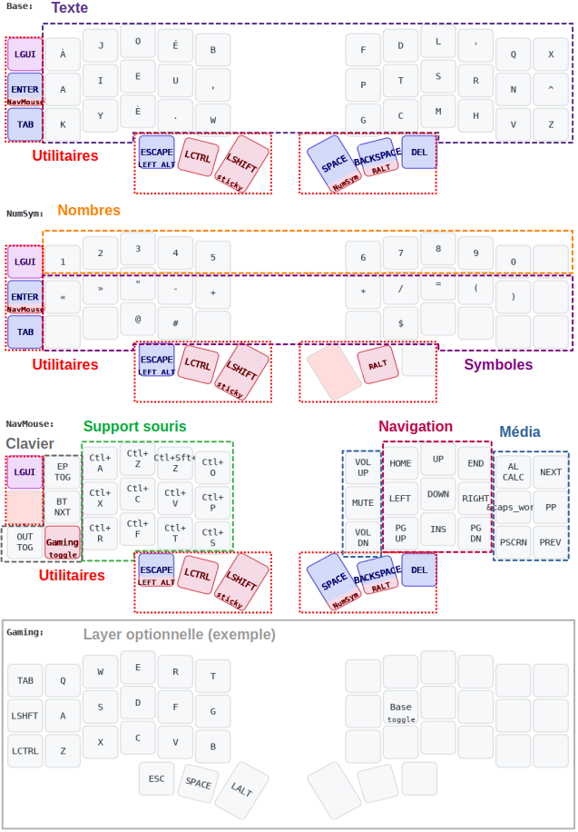

# An easy-to-learn Corne layout, with Optimot as a basis

- _Layout: [Optimot](https://optimot.fr/) (choose Optimot ISO as driver)_
- _Keyboard: [Corne](https://github.com/foostan/crkbd)_
- _Firmware: [ZMK](https://zmk.dev/)_

## Features :
- **Mouse-friendly** (right-handed)
	- Utility modifiers heavily clustered on the left hand
	- A mouse-support layer on the left hand
- **Easy to learn, easy to swap**
	- Few layers
	- Utility keys don't change between layers
	- Familiar numbers and symbols layouts
	- Usual navigation shortcuts, yet more accessibles; no dedicated key nor homerow mod (_only learn once_)
- **Painless shortcuts**
	- Text modifiers under the thumbs (`SymNum`, `Shift` and `AltGr`)
	- Modifiers and layer switchers are easily comboed
	- Navigation and deletion are combinable with `ctrl`, `shift` and `GUI`
- **Leverages Optimot**
	- The Optimot layout is highly optimised for French and English secondarily
 	- It provides with many ideally placed characters
  	- `AltGr` is in a key position to access them

## Limitations:
- `AltGr+Space` (non-breaking space) is not really possible 
- `Caps-word` doesn't stop with some punctuation characters (ZMK limitation)

## Notes:
- Meant for Linux; Windows should work; MacOS would require light changes.
- What is loaded as firmware differs from the picture, as Optimot drivers modifies the QWERTY layout downstream
- The gaming layer is entirely optional
- `Alt` and `GUI` may be swapped depending on one's use
- The left hand mouse-support layer does not feature browser navigation, but any mouse with five buttons or more will have it
